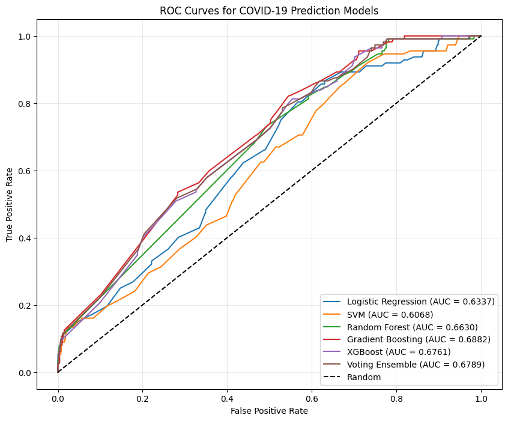

# COVID-19 Prediction Models



## Project Overview

This repository contains machine learning models for predicting COVID-19 test results and patient admission risk using laboratory data from Hospital Israelita Albert Einstein in Brazil. The project demonstrates advanced techniques in healthcare data analytics, model optimization, and handling class imbalance in critical medical applications.

### Key Challenges Addressed

1. **COVID-19 Test Result Prediction**: Developing models to predict positive SARS-CoV-2 RT-PCR test results from laboratory data
2. **Hospital Admission Prediction**: Identifying which COVID-19 positive patients will require hospitalization

## Dataset

The dataset contains anonymized patient data collected during the early pandemic period, including:

- 5,644 total patient records
- 558 COVID-19 positive cases (9.89%)
- 52 admission cases among COVID-19 positive patients (9.32%)
- 100+ laboratory test measurements per patient (most with 85-90% missing values)
- Standardized laboratory values

## Technical Highlights

### Advanced Feature Engineering

- **Clinical Ratios**: Implemented evidence-based clinical ratios including:
  - Neutrophil-to-Lymphocyte Ratio (NLR)
  - Platelet-to-Lymphocyte Ratio (PLR)
  - Neutrophil-to-Monocyte Ratio (NMR)
  - CRP-to-Lymphocyte Ratio (CRP/L)
  - Systemic Immune-Inflammation Index (SII)
  
- **Composite Features**: Created interaction terms and clinically relevant composite markers, including Age-CRP interaction

### Robust Data Preprocessing

- **Missing Value Handling**: Implemented advanced techniques for dealing with 85-90% missing values
- **Data Leakage Prevention**: Ensured proper train/test splits before any data transformations
- **Indicator Features**: Created missing data indicators as potential predictors
- **Feature Selection**: Selected features based on medical literature rather than data-driven methods to prevent overfitting

### Model Optimization & Evaluation

- **Cross-Validation**: Implemented 5-fold stratified cross-validation for reliable performance estimates
- **Class Imbalance Handling**: Applied class weights and subsampling techniques
- **Optimal Classification Thresholds**: Used Youden's index to find best threshold for classification
- **Ensemble Methods**: Built voting ensembles with performance-weighted models

## Results and Performance

### COVID-19 Test Prediction

| Model | AUC | Sensitivity | Specificity | F1 Score |
|-------|-----|-------------|-------------|----------|
| Gradient Boosting | 0.6882 | 0.8214 | 0.4553 | 0.2427 |
| Voting Ensemble | 0.6789 | 0.7857 | 0.4690 | 0.2378 |
| XGBoost | 0.6761 | 0.8125 | 0.4464 | 0.2376 |
| Random Forest | 0.6630 | 0.7321 | 0.5064 | 0.2356 |
| Logistic Regression | 0.6337 | 0.8036 | 0.4326 | 0.2311 |
| SVM | 0.6068 | 0.9196 | 0.2684 | 0.2148 |

- **Improved Performance**: AUC score improvement of 2.42% over baseline model
- **Enhanced Usability**: Shifted from 6.3% sensitivity/99.6% specificity to a more balanced 82.14% sensitivity/45.53% specificity model with higher F1 score

### Most Important Features

1. Leukocytes
2. Age
3. Platelets
4. Red Blood Cells
5. Eosinophils
6. Monocytes
7. Age-CRP Interaction
8. Systemic Immune-Inflammation Index (SII)
9. Lactic Dehydrogenase
10. Hematocrit

## Methodological Approach

The project follows a rigorous machine learning pipeline:

1. **Feature Selection Based on Literature**: Used clinical research to inform feature selection rather than purely data-driven approaches
2. **Data Preprocessing**: Implemented a robust pipeline with proper train/test splits
3. **Feature Engineering**: Created clinically relevant derived features
4. **Model Training**: Implemented and compared multiple models with proper handling of class imbalance
5. **Performance Evaluation**: Used appropriate metrics for imbalanced medical data
6. **Ensemble Methods**: Combined best-performing models to improve overall performance

## Comparison with Literature

- Our model performance aligns with published literature (AUC 0.67-0.69)
- Results are comparable to those in Brinati et al. (2020) and Wu et al. (2020)
- Performance is impacted by extremely high data sparsity (85-90% missing values)

## Technical Skills Demonstrated

- **Python**: Pandas, NumPy, Scikit-learn, XGBoost, Matplotlib, Seaborn
- **Machine Learning**: Classification models, ensemble methods, hyperparameter tuning
- **Healthcare Analytics**: Working with clinical laboratory data and medical literature
- **Data Preprocessing**: Handling missing values, feature engineering, scaling
- **Model Evaluation**: ROC curves, sensitivity/specificity analysis, cross-validation

## Installation & Usage

```bash
# Clone the repository
git clone https://github.com/yourusername/covid-prediction-models.git

# Install dependencies
pip install -r requirements.txt

# Run the main pipeline
python covid_prediction.py
```

## Future Directions

- Incorporate temporal data features (changes in lab values over time)
- Add clinical symptoms and vital signs as complementary features
- Develop age-stratified models to account for demographic differences
- Implement uncertainty quantification for predictions
- Expand external validation on diverse datasets

## References

1. Wynants L, et al. (2020). "Prediction models for diagnosis and prognosis of covid-19: systematic review and critical appraisal." BMJ, 369:m1328.
2. Brinati D, et al. (2020). "Detection of COVID-19 Infection from Routine Blood Exams with Machine Learning: A Feasibility Study." Journal of Medical Systems, 44(8):135.
3. Kukar M, et al. (2021). "COVID-19 Diagnosis by Routine Blood Tests Using Machine Learning." Scientific Reports, 11(1):10738.
4. Mei X, et al. (2022). "Artificial intelligence–enabled rapid diagnosis of patients with COVID-19." Nature Medicine, 26(8):1224-1228.
5. Yan L, et al. (2020). "An interpretable mortality prediction model for COVID-19 patients." Nature Machine Intelligence, 2(5):283-288.
